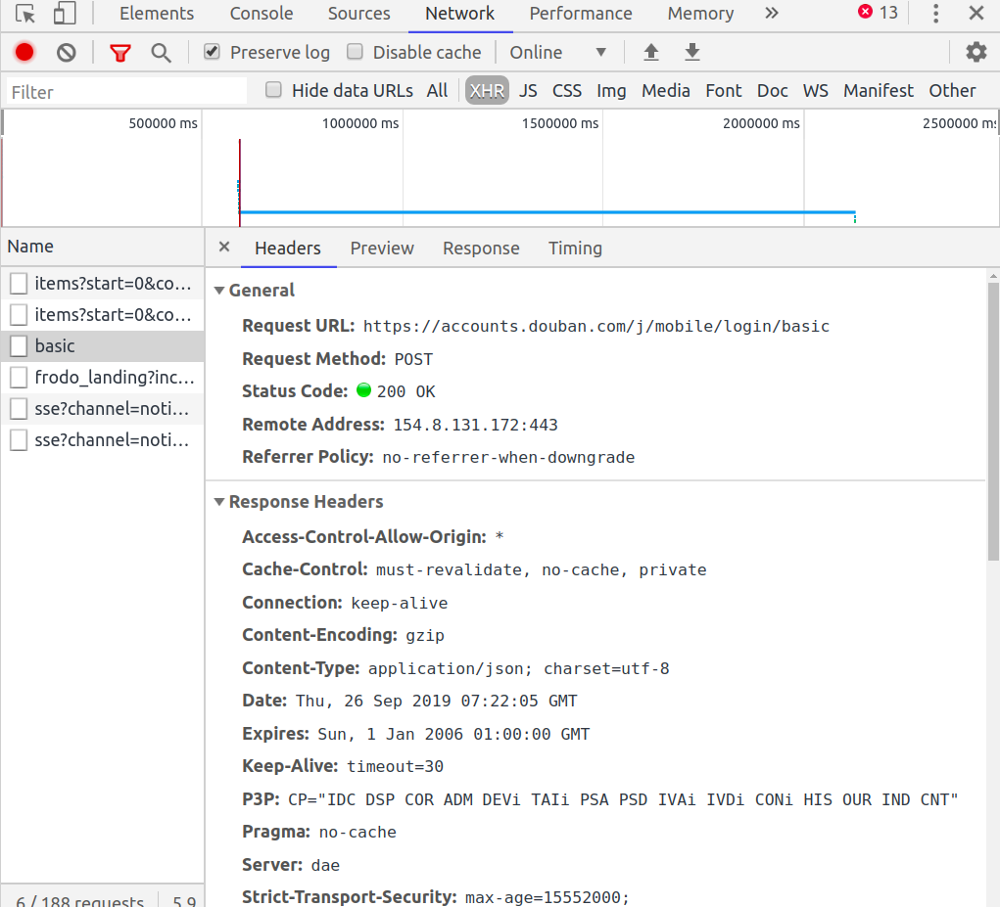
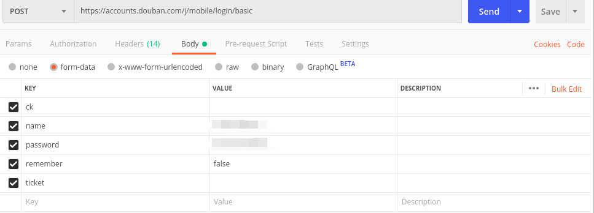
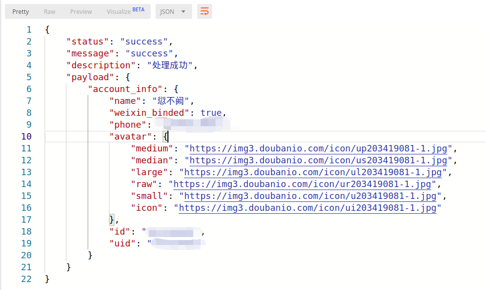

# 模拟登陆

大部分的网页都是动态的，我们所需要的信息也需要登陆之后才能获得；比如学校教务处的成绩和课表，知乎用户个人的信息，这些都需要我们先进行登录，才能进行下一步的操作（爬虫）。现在来简单说下如何进行最简单也最基本的模拟登录。

现在大多数网站都有反爬虫机制，验证的规则也五花八样，想找到一个能练手的网站实在不容易。好在[豆瓣](https://www.douban.com/)算是比较宽容的，它只有在发送登录请求十分频繁的条件下，才会放滑块验证这个大招。所以我们现在便以豆瓣为例。

# 找到账户验证的url

>   如果已经登录了豆瓣的，要先退出登录

打开豆瓣，按下 F12 （Fn+F12），审查元素，在最上面的一栏选择网络（Network），可以按下 Ctrl+R 刷新一下，然后就可以看到下方的列表里有很多条目，这些都是该网页在获取数据时请求的痕迹。


现在不要关闭开发者模式（审查元素界面），填入豆瓣账号和密码，点击登录，然后你会看到右边的界面重新进行了载入。

选择 XHR，对请求记录的 log 进行过滤，列表就只剩几个条目了。一个个点进去查看，基本上看 request URL 就知道哪个是账户验证的 API 了，但也并非绝对，有一些做的比较垃圾的网站就不会尊崇这种基本的命名规范，比如学校的云课堂，感兴趣的可以去看下。当然，实际上我们关注的也不是 Request URL，这只是方便我们在列表中查找罢了，实际上我们关注的是 Form Data（表单数据），我们填入的账户密码会以表单的形式提交给服务器进行验证。所以若发现 Form Data 里包含有我们的账户信息，那就绝对是我们要找的目标了。

我们要找的就是名为 basic 的这条记录，链接为 `https://accounts.douban.com/j/mobile/login/basic`，记住这个条目所展示的页面，许多数据我们都要用到。


# 模拟登录请求

找到了验证的 url 后，我们不应该马上动手写代码，而是应该用 postman 来进行模拟请求，确认是否可以成功通过验证。

>   postman请自行去[官网下载](https://www.getpostman.com/downloads/)

## 分析请求数据

要进行模拟请求，首先得要明白请求需要什么数据，以怎样的格式请求。这就需要我们进行分析了。



观察页面，看到它的 Request Method 是 POST，而 Request Headers 包含有如下七个字段（以自己浏览器中的信息为准）：


现在来观察Form Data的数据，有5个字段，其中对我们比较重要的就是 name 和 password 了。另外还有一个 ck 比较重要，这个我们之后再说。

```shell
ck:
name: xxxxxx
password: ********
remember: false
ticket:
```

现在知道了该填什么字段，那就可以进行模拟请求了。

## 模拟请求

打开 postman，填入用以验证的 url，将 method 设为 post，填入 Request Headers 和 Form Data，然后就可以请求了。


填入 Form Data：




请求成功，postman 将 response 数据自动显示为 json 格式。




## 意外的失败

可能你会发现照着这样做请求却失败了，或是第一次请求成功，第二次请求却失败了，这就要我们来更改一下ck字段的值。可以回到浏览器，在已经登录的界面中，打开审查元素，点击元素（Elements）那栏，Ctrl+F，填入 ck进行搜索，找到 `<input type="hidden" name="ck" value="Qg5w">` 这栏，其中 value 的值就是我们要的值，将 Qg5w 填入 postman 中的 ck 字段，这样 就可以重新请求了。

# 代码实现

## 基本实现

既然模拟请求已经成功，那么就可以用代码实现了。

要用到的包有：`net/http`，`net/url`，`io/ioutil`

>   net/http [官方文档](https://godoc.org/net/http)
>
>   net/url [官方文档](https://godoc.org/net/url)
>
>   io/ioutil [官方文档](https://golang.org/pkg/io/ioutil/)

```go
// 请求url
requestUrl := "https://accounts.douban.com/j/mobile/login/basic"

// 加入表单数据
data := url.Values{}
data.Set("name", "xxxxx")
data.Set("password", "****")
data.Set("remember", "false")
data.Set("ck", "")
data.Set("ticket", "")

payload := strings.NewReader(data.Encode())
```

添加 http 请求

```go
req, err := http.NewRequest("POST", requestUrl, payload)
if err != nil {
	panic(err)
	return
}
```

添加 Request Headers：

```go
req.Header.Add("Accept", "application/json")
req.Header.Add("Content-Type", "application/x-www-form-urlencoded")
req.Header.Add("Origin", "https://accounts.douban.com")
req.Header.Add("Referer", "https://accounts.douban.com/passport/login_popup?login_source=anony")
req.Header.Add("Sec-Fetch-Mode", "cors")
req.Header.Add("User-Agent", "Mozilla/5.0 (X11; Linux x86_64) AppleWebKit/537.36 (KHTML, like Gecko) Chrome/76.0.3809.132 Safari/537.36")
req.Header.Add("X-Requested-With", "XMLHttpRequest")
```

发起请求：

```go
res, err := http.DefaultClient.Do(req)
if err != nil {
	panic(err)
	return
}
defer res.Body.Close()
```

解析请求body，这里要用到`io/ioutil`包

```go
body, err := ioutil.ReadAll(res.Body)
if err != nil {
	panic(err)
	return
}
```

输出查看

```go
fmt.Println(string(body))
```

运行结果：

```markdown
{"status":"success","message":"success","description":"处理成功","payload":{"account_info":{"name":"愆不阙","weixin_binded":true,......以下省略......}}}
```

## 优化

虽然实现了请求，但还有一个问题需要完善一下，那就是我们的账号和密码是写在代码中的，极不安全。我们可以通过交互模式让用户在终端输入。另外密码的输入应当是隐性的、保密的，这就用到了 [`gopass`库](https://github.com/howeyc/gopass)。gopass 库的使用算是非常简单的了，自己看文档吧。

>   gopass [官方文档](https://godoc.org/github.com/howeyc/gopass)

实现输入：

```go
var name string
fmt.Print("输入账号：")
_, _ = fmt.Scanln(&name)
fmt.Print("输入密码：")
password, _ := gopass.GetPasswdMasked()
```

这样就算是比较完善了

>   [完整代码](https://github.com/Shadowmaple/go/blob/master/crawler/doubanLogin.go)
