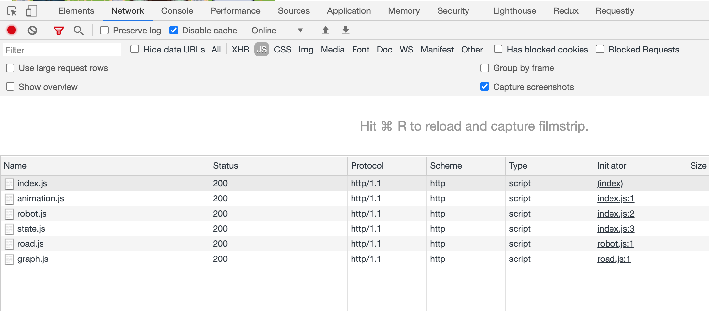
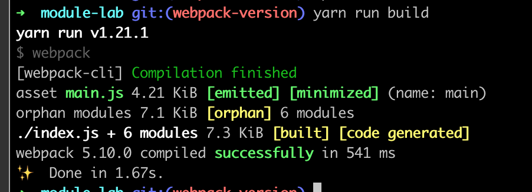

# Lab: 使用 Webpack 对 JS 应用进行构建


## 介绍

Eloquent JS 第 10 章对模块、包管理器 NPM、JS 模块实现标准 CommonJS 和 ES Module 这些话题做了介绍。但里面并没有非常实际的项目作为例子。

在之前的 JS 练习中，我们可以将 JS 在浏览器开发者工具的 Console 中运行。或者在 HTML 中通过 `<script/>` 标签引入一个 JS 文件。

看过第 10 章之后，我们应该有一个共同的认知：**在正经的项目中，使用模块是必要的**。因为在一个项目中，可能有几十上百个 JS 文件，我们不希望这些文件中声明的变量都在全局作用域，这样会相互冲突。所以我们必须使用模块。

接下来我们会将第 7 章中介绍到的一个项目： [邮差机器人](https://eloquentjavascript.net/07_robot.html)，改造为一个模块化的项目。

## 准备工作

首先，书中没有提供每个项目的完整（独立 HTML + JS）代码。所以我们按书上的代码，配合 Github 上书本源码，把这个项目独立的拆出来了。在[这个仓库](https://github.com/Muxi-Studio/js-modular-lab)。

cd 到项目目录下，跑一个 `http-server` 之后就可以访问这个项目了。


> 本地开发不要直接把 HTML 用浏览器打开（使用 file 协议），这个协议和 HTTP 不同，所以可能会出现一些不一致的情况。最终项目都是要放到服务器上通过 HTTP 协议打开的，因此大家还是耗子尾汁，用 `http-server`。不知道如何安装的同学，先安装 Nodejs。然后 `yarn global add http-server`

大家看一下代码，会发现里面一共有两个 JS 文件。其中一个 JS 文件用 [IIFE](https://developer.mozilla.org/en-US/docs/Glossary/IIFE) 做了简单的作用域隔离。

IIFE 这种原始的形态有一个问题，就是所有文件都必须写在几个 JS 里面（如果 JS 拆分的很多，就需要考虑引入的顺序问题，非常麻烦。比如一个文件依赖的变量在后面引入的 JS 里，就会报错），这样维护的时候很不方便，就需要去一个很长的文件里找代码在哪。并且这样也没法使用 NPM 这样的包管理器引入第三方包，因为压根没有模块机制。

做这个 Lab 之前请确保你已经熟读了 EloquentJS 第 10 章，熟悉了 ES Module 语法，并且对 npm 有了初步的使用经验。

接下来就让我们开始模块化之旅！！！

## 任务一：使用原生 ES Module 改造 Robot 项目

拉一个新的分支: esm-version。

首先，我们需要对之前的两个 JS 文件做拆分。拆成如下的几个模块：

```
index.js
- src
  - road.js
  - route.js
  - graph.js
  - state.js
  - animation.js
  - robot.js
```

具体哪些函数和 Class 拆到哪些文件，大家可以看 Eloquent JS 第 10 章的练习：A Modular Robot 的 [Hint](https://eloquentjavascript.net/10_modules.html#p_o3MT4wM7DB)。

一般来说，如果一个文件有一个主要的类，这个类会用 default export。如果一个文件里是几个优先级差不多的函数，就用 named export。在有 default export 的模块里我们也可以用 named export 去暴露一些小函数。

在 index.js 里大概是这样的（不一定要完全相同，作者在 Hint 里也说了，模块拆分没有标准答案，但 index.js 里面必须是把整个 JS 应用运行起来的一些启动代码）：

```javascript
import { runRobotAnimation } from "./src/animation.js";
import { goalOrientedRobot } from "./src/robot.js";
import VillageState from "./src/state.js";

runRobotAnimation(VillageState.random(), goalOrientedRobot, []);
```

到这里模块化改造就完成了。目前 Chrome 浏览器已经原生支持 ES Module 了。所以理论上来说，我们只需要引入 index.js 入口文件，整个项目就可以直接跑起来。浏览器会支持 import 和 export 等等关键词，并帮我们去发请求获取这些 JS 文件。

> [这里](https://developer.mozilla.org/en-US/docs/Web/JavaScript/Guide/Modules) 有一个 ES Module 的完整教程。我们可以看到除了 IE 之外的浏览器的近期版本都支持了 import 和 export。

我们修改 index.html

```html
<!DOCTYPE html>
<html lang="en">
  <head>
    <meta charset="UTF-8" />
    <meta name="viewport" content="width=device-width, initial-scale=1.0" />
    <title>Robot</title>
  </head>
  <body></body>
  <script src="./index.js" type="module"></script>
</html>

```

主要是把之前的两个 `<script/>` 标签改为一个，因为现在只需要引入入口 js 即可。然后我们需要给 `<script/>` 标签加一个 `type="module"`。这样浏览器就知道这个 JS 是一个 ES Module。

启动 `http-server`，没有什么意外的话，打开页面后，机器人正常运行！

看上去没什么特别的，但我们现在把整个应用改造为了模块化的结构。负责不同功能的代码都放在各自文件里面。这些文件里面声明的顶级变量也只能在模块内被访问。模块里面如果有需要暴露给外部的变量，可以通过 export 去显式声明。需要用到的其他模块的变量，可以通过 import 显式去引入。这样就让模块之间相互隔离，但又可以通过设计好的接口来相互调用，一切都是井井有条。**在模块化的架构下，我们就可以编写数万行代码的大型应用了**。


### 任务成果要求

+ 将使用 ES Module 改造过的模块化的 Robot 项目推到 esm-version 分支，并可以成功运行。

## 任务二：使用 Webpack 对模块化的 Robot 项目做打包

在继续之前，我们需要了解到一个知识点：对每个域名，浏览器都有一个最大并发请求数限制，这个限制[一般是 6 个](https://cloud.tencent.com/developer/article/1683127)。这是因为 HTTP 底层用的 TCP 客户端在系统中的端口数是有限的。同时也是为了防止服务器那边压力过大。

也就是说，在同时刻，对于每个域名，最多只能有 6 个进行中的请求，如果有超过 6 个的，会进入等待（Pending）状态，直到前 6 个请求中有其他请求完成后才会被发送。

我们可以在浏览器开发者工具的网络 Tab 中看到模块化之后的机器人页面的 JS 请求情况（如果看不到请求，请刷新页面）：



这里选中的是 JS 资源，我们也可以切到 All，里面还展示了图片等其他资源的请求。

因为我们的服务是在本地启动的，不需要经过公网传输，所以请求速度很快。这个时候我们很难发现所谓的并发请求数限制带来的问题。

但是在生产环境，各种资源通过公网传输，并且正常项目的模块数量也远远大于目前这几个，至少有几十个-数百个不等。如果页面打开之后需要发送几十个请求，显然只能先发 6 个，然后慢慢排队，等待前面的请求完后让出坑位，依次完成。

我们访问一个网站，比如淘宝，我们就可以在 Network Tab 中看到请求是一批一批发送的，呈阶梯状，也像一个瀑布。这种图一般叫 Waterfall，可以用来分析页面请求的耗时情况：


所以如果直接使用 ES Module 方案，页面可能需要等几十秒才能打开，这显然是无法接受的。

解决方案很简单，就是事先把所有 JS 模块拼接起来，打包为几个文件，最后只需要请求打包之后的几个文件就可以了。

这就是 [Webpack](https://webpack.js.org/) 出现的原因之一。

> 关于 Webpack 出现的原因，涉及到 Web 前端开发的历史，大家可以看[官方文档中的描述](https://webpack.js.org/concepts/why-webpack/)。

接下来就让我们使用 Webpack 来对 Robot 项目进行打包。

从之前的 esm-version 为基础拉一个新分支: webpack-version。

因为要用到其他 NPM 包，所以需要将我们的项目初始化为一个 NPM package。

在项目目录下运行：

```
npm init
```

命令行会提示输出项目名称，描述，作者，仓库地址，开源协议等等一堆的元信息。暂时不填的字段直接回车即可。

然后就会有一个 package.json 生成，这个 json 文件里面包含了当前项目的基本信息，比如入口文件，启动命令，依赖版本等等。

然后我们安装 Webpack 需要的依赖:

```
yarn add webpack webpack-cli -D
```

> yarn 比 npm 更好用一些。如果速度慢，可以 `yarn config set registry https://registry.npm.taobao.org` 设置国内源。

然后可以看到 package.json 中已经出现了这两个依赖：

```json
 "dependencies": {
    "webpack": "^5.10.0",
    "webpack-cli": "^4.2.0"
 }
```

然后我们在项目目录下新建一个 `webpack.config.js`:

```javascript
const path = require("path");

module.exports = {
  entry: "./index.js",
  output: {
    filename: "main.js",
    path: path.resolve(__dirname, "dist"),
  },
  resolve: {
    extensions: [".js"],
  },
};
```

这个配置指定了入口为 `./index.js`。输出文件名为 main.js，输出的目录是当前目录下的 dist 文件夹。resolve 的作用是提示 import 路径的后缀名。

比如我们可以这样写 `import foo from "./bar"` 而不用写 `import foo from "./bar.js"`。大家可以把 import 路径中的 js 去掉。

最后我们需要些一个 npm script 作为启动 webpack 构建的命令：

```json
"scripts": {
    "build": "webpack"
},
```

在 package.json 的 scripts 字段里加一个 build 命令。

然后跑 `yarn run build`，结果如图：



我们构建出了一个 main.js 文件，这个文件包含了 index.js 依赖的所有模块。所以现在我们只需要引入这一个 js 文件即可。

在 index.html 中做如下修改：

```
--- <script src="./index.js" type="module"></script>
+++ <script src="./dist/main.js"></script>
```

修改一下路径，然后去掉 type，因为现在我们引入的是单个的 js 文件，不需要浏览器解析 ES module 了。


此时启动 `http-server`，你可以看到熟悉的机器人画面。

**恭喜你，你完成了人生第一次 Webpack 构建！！**

### 任务成果要求

基于 esm-version 分支，使用 Webpack 进行构建，最终可以成功运行机器人项目。推到 webpack-version 分支。

## 拓展练习：前端工程化


相信你对 Webpack 的基本使用，已经有了一些经验。对于 Webpack 打包的作用，也有了一定的理解。但 Webpack 只是用来打包的吗？

现代的项目开发，基本都离不开 Webpack。原因就是，Webpack 是前端工程化的基石。等等，什么是工程化？

很简单，比如像 C 语言这样的代码，需要经过编译之后才能运行。比较复杂的 C 项目则需要链接第三方库，然后一起编译。这个时候流程就会比较复杂。所以会写一个 makefile，里面写上各种编译命令，然后用 make 工具来运行。这样的好处就是可以有一个统一的工具来对编译做处理，并且有一个配置文件，把各种复杂的编译命令管理起来，方便重复调用。

一个大型项目必然是复杂的，也必然是模块化的。众多模块要链接在一起，最终才能成功编译出目标产物（比如一个软件）。就像造汽车，各种生产好的零部件，在一个工厂组装起来。有一个流水线，重复着事先定义好的各种步骤，才能批量生产。这就是一个系统工程了。编写软件也是一样的。

JS 是脚本语言，直接由解释器运行，不需要经过编译。但随着前端的发展，为了对 JS 的功能做增强，目前我们编写的源代码，通常是用 TypeScript 等等编译到 JS 的语言编写的。并且我们还可能会为了开发效率，使用一些最新的 JS 特性（旧版本浏览器不支持），这个时候我们可以使用 Babel 这样的工具对 JS 做转译，比如从 ES6 转译成等效的 ES5 代码，这样就可以保证 JS 代码在大部分浏览器中都可以运行。

CSS 也一样，有着很多的问题，比如类名的作用域是全局的，稍有不慎就会相互影响。比如没有变量和函数等等复用代码的机制。后来出现了 [Sass](https://sass-lang.com/) 和 [Less](http://lesscss.org/) 等等高级的样式处理器，可以通过简洁的语法编写样式代码，最终生成的依然是 CSS。比如：

这样的 Less 代码

```less
.foo {
  .bar {
    color: red;
  }
  .baz {
     color: blue;
  }
}
```

会生成这样的 CSS 代码。

```css
.foo .bar {
    color: red;
}
  
.foo .baz {
     color: blue;
  }
}
```

如果父子选择器层级更深，直接写 CSS 就会很难维护，而 Less 的嵌套语法就避免了这个问题。另外 Less/Sass 中还支持定义变量，Mixin 等方式来让 CSS 变的更加可维护。

以上提到的只是工程化链路中的两个点。此外，JS 代码一般需要经过压缩（为了减小体积）和混淆，图片也需要做压缩和内联处理，这些也是在 Webpack 中完成的。

Webpack 提供了 Loader 和插件等机制，让前端工程化相关的工具，都可以接入到 Webpack 体系中。Webpack 提供的是一个平台，各个插件和 Loader 可以对资源（JS/CSS/图片）做各种处理（转译，压缩等等），最终 Webpack 会把这些构建产物打成一个包（Bundle）输出。我们最后再把 HTML 和构建出的产物，上传到服务器上做部署。


> Webpack 所能做的事情，远不止上述的。前端应用的开发，构建，部署中和工程化相关的任务，多多少少都和 Webpack 有着一些关系。目前大家可以先了解 Webpack 的基本使用，常用的配置项，常用的 Loader 这些基础概念。后面随着参与真正的项目开发，会接触到更多的使用场景。

接下来就出几个场景，让大家感受和练习一下 Webpack 的相关生态。

### 使用现成的 Npm 包替换寻路算法

Eloquent JS 第 10 章中有[讲到](https://eloquentjavascript.net/10_modules.html#c_NyRXVpwPYN)，可以使用 Npm 包 `dijkstrajs` 来做寻路。

Npm 上有大量的 JS 包，每个包都提供了某种功能。对于一些常见的算法，我们可以直接复用 Npm 上的包，而不是自己重复写。对是否应该用 Npm 包，作者的练习题的 Hint 中也有讲到：


> By offloading some work to NPM modules, the code became a little smaller. Each individual module does something rather simple and can be read on its own.

> Is it a good idea to use NPM modules for things that we could have written ourselves? **In principle, yes—for nontrivial things like the pathfinding function you are likely to make mistakes and waste time writing them yourself. For tiny functions like random-item, writing them yourself is easy enough. But adding them wherever you need them does tend to clutter your modules**.

> **However, you should also not underestimate the work involved in finding an appropriate NPM package. And even if you find one, it might not work well or may be missing some feature you need**. On top of that, depending on NPM packages means you have to make sure they are installed, you have to distribute them with your program, and you might have to periodically upgrade them.

> So again, this is a **trade-off**, and you can decide either way depending on how much the packages help you.


**trade-off**，这是有利有弊的，所以简单的说，it depends，视情况而论。

> 软件工程中处处都是 **trade-off**，很少有十全十美的设计决策。只有最适合的。

**任务要求：**

+ 使用 `dijkstrajs` 替换 Robot 中的寻路算法。
+ 思考：如果是 esm-version 的代码，可以直接使用 Npm 包吗？为什么？提示：Npm 的出现早于 ES Module。Npm 上包的模块规范大部分是 CommonJS。


### 认识 Babel：在 IE 上运行 Robot

大家可以使用 [Github Pages](https://zhuanlan.zhihu.com/p/38480155)，把我们 Webpack 构建版本的项目部署到服务器上。最终可以通过 `https://xxx.github.io/module-lab` 这样的页面打开。

如果用 Windows 开发的同学，也可以用 IE 打开 localhost 链接。

如果在 IE 里运行 Robot 项目，会怎样呢？

显然，在 IE 下这个页面会报错，因为我们使用了很多 ES6 特性。打开 F12 开发者工具我们可以看到：


// TODO 报错截图


这是因为 IE 不支持 ES6 的特性导致的。比如 IE 不支持 const 这样的变量声明。

我们如果想让项目在 IE 上跑起来，就需要一个工具，把我们项目里用到的 ES6 特性转换为 ES5 版本。比如把 const 转为 var。

这个工具就是 [Babel](https://babeljs.io/)。Babel 就是巴别塔的意思，隐含了翻译的意思。最初 Babel 的项目名叫 Six To Five，就是 ES6 转为 ES5 的意思。发展到今天，Babel 已经不只是用于做 ES6 转换 ES5 了，因为随着 IE 被抛弃，其他的主流浏览器都支持 ES6，所以现在我们的项目一般也不需要做太多转译。Babel 现在可以理解为一个插件化的 JS 解析器，可以提供插件，让我们对 JS 的语法树做分析和修改（涉及一些编译原理常识，不理解正常）。利用 Babel，我们可以实现一些自定义的语法，比如 React 中的 JSX（后面会接触）。


**任务要求：**


+ 为 Webpack 配置 Babel，使用 babel-preset-env 并设置 `targets` 为 ie11。提示：教程用谷歌搜 `Webpack Babel`。
+ Webpack 生成的 JS 中，有一部分代码是 Webpack 自己插入的，是为了把各个模块连接起来。所以我们要给 Webpack 配置 target 属性，值为 `['web', 'es5']`。这可以保证 Webpack 自己生成的代码也是 ES5 的。
+ 代码基于 `webpack-version` 分支，拉取一个 `babel-version` 分支。
+ 把这个代码部署到 Github Page 并在 IE 上成功运行。


### 加速本地开发：初识 Webpack-dev-server


`webpack-version` 分支有一个问题，如果我们要基于 Robot 代码继续做开发，每次修改代码后，我们都要运行 `yarn run build` 才能刷新页面看到最新的效果。这样的效率太低了！

有没有一个开发服务器，可以自动监听 JS 文件的变化，然后运行构建呢？这样我们修改代码之后，只需要刷新页面就可以看到最新的效果了。

答案就是 [webpack-dev-server](https://github.com/webpack/webpack-dev-server)

**任务要求：**

1. 基于 `webpack-version` 分支，拉取一个 `webpack-dev-server-version` 分支。
2. 将目前的一份 Webpack 配置改为 `webpack.dev.config.js` 和 `webpack.prod.config.js`。prod 的配置和之前的那份一样，配置 mode 为 `'production'`。dev 这份配置 mode 为 `'development'`。
3. `webpack.dev.config.js` 中配置 Webpack-dev-server 相关配置。参考[教程](https://webpack.js.org/guides/development/)。这里介绍了三种开发的方式，看 dev-server 那种即可。

> 如果图片挂掉，注意把 devServer 的 contentBase 属性设置为 `"./"`。contentBase 就是指 dev-server 找静态文件的根路径。

4. 设置两个 npm script，一个是 build，用于构建生产包，使用 webpack.prod.config.js 配置。一个是 dev，用于启动 webpack-dev-server 进行本地开发，使用 webpack.dev.config.js 配置。提示：使用 `webpack --config` 指定配置文件路径。**运行 `yarn run dev` 即可启动开发服务器，页面运行正常。修改代码后，刷新页面，可以看到效果**。
5. （加分项）用 [webpack-merge](https://github.com/survivejs/webpack-merge)，将 `webpack.dev.config.js` 和 `webpack.prod.config.js` 中的共同部分抽取为 `webpack.common.config.js`。
6. （加分项）使用 [file-loader](https://webpack.js.org/loaders/file-loader/) 把图片引入 Webpack 的构建体系。思考这种方式的好处是什么。

> 其实直接用 esm-version 那种方式的开发体验是最好的，直接刷新页面即可。所以现在出现了很多基于 ES Module 的开发工具，比如 [Snowpack](https://www.snowpack.dev/)，这种方式叫 Bundleless。也就是不对 JS 做打包，只是运行一下 Babel/SASS 之类的转换，然后让浏览器直接做 import。不过目前来看，生产构建必须使用 Webpack 做打包（因为之前说过的网络原因和 Webpack 现存的庞大插件生态）。对普通规模的项目来说，Webpack 的本地开发体验也不算差，所以 Bundleless 可能在这几年还不会是主流。


### 脚手架 Create React App 的秘密（研究性学习）

在实际的项目开发中，我们通常会使用**脚手架**来初始化项目。因为配置 Webpack 是一项繁复的工作，所以如果有一个工具可以自动生成配置，就可以大大加速项目的搭建。

常用的脚手架，比如 [Create React App](https://create-react-app.dev/)。这款脚手架是用来初始化 React 项目的，但同样可以用来初始化普通的 JS 项目。

在这个任务中，希望大家尝试使用 Create React App 初始化一个项目，并且对 Create React App 的原理做一些探究。


**任务要求：**

+ 使用 Create React App 创建一个项目，并在本地可以启动。（不懂 React 什么的没关系，就当是一个和 Robot 一样的普通 JS 应用）。
+ Create React App 似乎没有用到 Webpack，就可以实现构建，本地开发等等功能，这究竟是如何实现的呢？提示：使用 [eject](https://create-react-app.dev/docs/available-scripts#npm-run-eject) 功能。
+ 写一篇博客，分析 Create React App 本质上是如何进行构建的（包装了 Webpack）。分析他的 Webpack 配置，看看有哪些不懂的，搜索这些配置，写下你的收获。


### 探究 Webpack 原理：分析 Webpack 构建产物


## 结语

祝贺你，如果你完成了上述的拓展任务，现在你已经是 **前端工程化** 的专家了！！在未来的项目实战中，不管是使用脚手架，还是直接使用 Webpack，都要搞清楚自己的项目是如何构建的，npm scripts 里面的那些命令又是如何工作的。这样在遇到问题的时候，才会认清问题的本质出在哪，从而快速定位和解决问题。

前端工程化并不难，如果觉得难，就是没有学好基础。像本次实验一样，从源头来一步一步的学习项目的构建，也是以后学习其他工程化相关工具的一个范本。有问题多试验，多思考，问题的本质总归是简单的。


